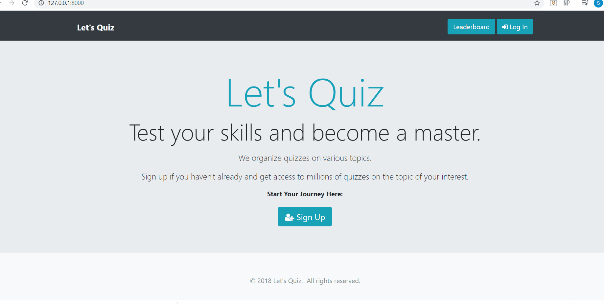

## Let-s-Quiz-Django
This is an online quiz organizing website project, developed using Python's web framework Django.
For front-end designing I have used Twitter's front-end library Bootstrap4.

## Demo link

